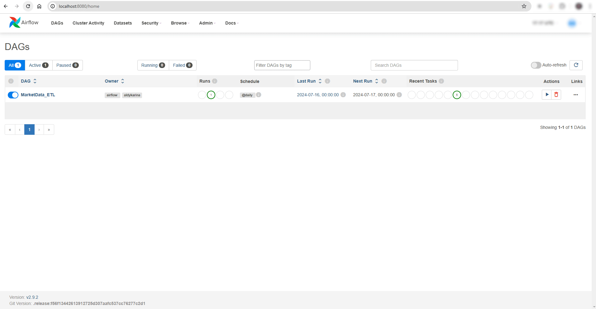
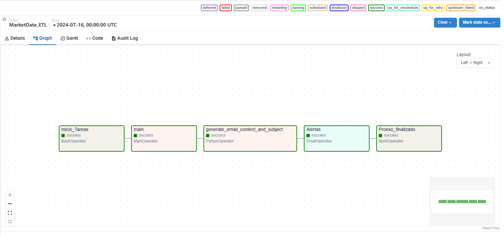

# Proyecto de consumo de APIS e ingesta a Redshift



Objetivos

* Crear un pipeline que extraiga datos de APIS públicas de forma constante.
* Almacenar los datos en un Data Warehouse en Amazon Redshift.
* Crear 2 alertas por mail , con valores configurables desde Airflow. Configurado servidor con SMTP.

## Proyecto: Market Data

El proyecto consume datos de la API pública
[Alphavantage](https://www.alphavantage.co) la cual contiene datos historicos y en tiempo real de valores de la bolsa. 
Y a su vez de data de criptomonedas usando `ccxt.kraken`

## Requisitos

Todo los requisitos para correr el proyecto se encuentran en el archivo `requirements.txt` que se ejecuta automaticamente con docker.

## Docker

Comandos a utilizar

```bash
#iniciar docker compose del proyecto
docker compose up airflow-init
docker compose up --build

#detener el docker compose del proyecto
docker-compose down
```

## Airflow

Para acceder al portal dirigirse a http://localhost:8080/ en su navegador preferido y registrese con las siguientes credenciales: 

* usuario: airflow 
* pwd: airflow

## Configuracion de correo para mensajes airflow

* Configurar un correo Gmail con autenticación de dos pasos.
* Crear una contraseña específica para aplicaciones en la sección "Aplicaciones menos seguras".
* El correo y la contraseña generada se usarán para la configuración SMTP de Airflow.

## Tareas del DAG
1. Inico de tareas
2. Extracción de datos, Transformación de datos y Carga de Datos: Se conecta a la API de Alphavantage y ccxt.kraken para obtener los datos más recientes. Limpia y transforma los datos en el formato necesario para su almacenamiento en Redshift. Inserta los datos transformados en las tablas correspondientes de Amazon Redshift.
3. Configuración del mail: Asunto y contenido.
4. Alertas: Envía alertas por correo electrónico basadas en condiciones específicas.
5. Finaliza el proceso


